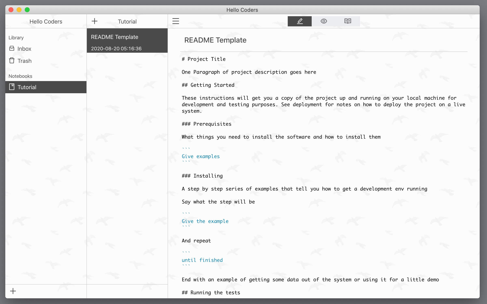
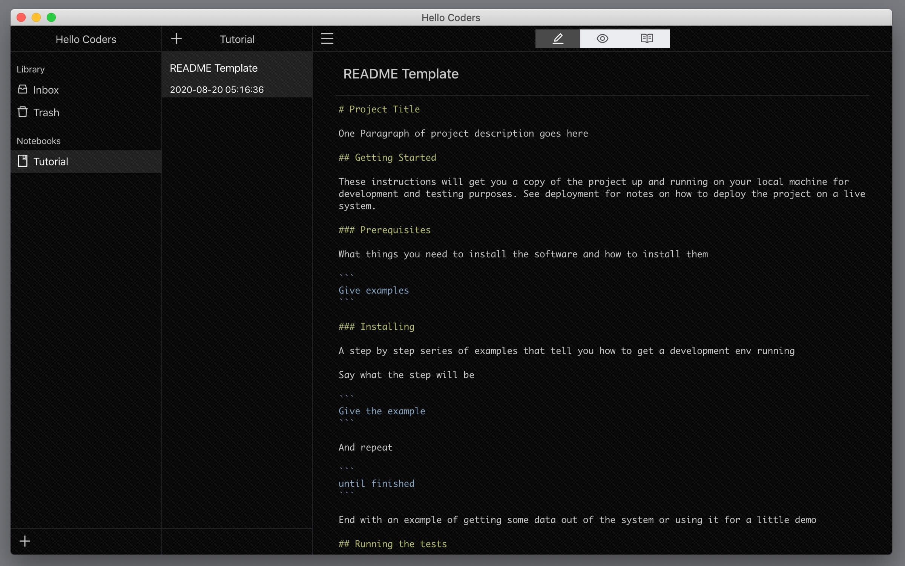

# Coder's Notebook

一款为程序员设计的笔记本.

## 日间模式

## 夜间模式

## TODO
+ [ ] 支持导入 Quiver
+ [ ] 支持一键部署到 hexo
+ [ ] 支持一键部署到 jekyll
+ [ ] 支持一键部署到 typecho
+ [ ] 支持在线版本更新
+ [x] 支持自定义 PATH
+ [x] 支持自定义软件名称
+ [x] 支持主题
+ [x] 支持多语言
+ [x] 集成简单的 postman 功能
